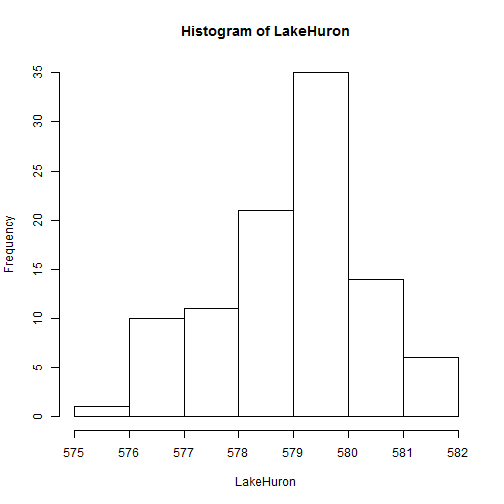

# Problem Set 1
# Michelle Newcomer
Stat 242 Fall 2013
========================================================

### Problem 1

Class survey: done

### Problem 2

a) I cloned the Git repository onto my machine using Github for Windows.

b) Commits made to my own repository on Git.


### Problem 3

# ```{r,engine='bash'}
# #! /bin/bash
# cd ~/Documents/Stat242PSFiles/PS1_link/
# wget -O Apricots526.zip "http://data.un.org/Handlers/DownloadHandler.ashx?DataFilter=itemCode:526&DataMartId=FAO&Format=csv&s=countryName:asc,elementCode:asc,year:desc&c=2,3,4,5,6,7&"
# unzip Apricots526.zip
# sed 's/, / /g' UNdata_Export_20130908_182447415.csv > UN_No_Comma.csv
# sed 's/\"//g' UN_No_Comma.csv > UN_No_Quote.csv
# grep -i + UN_No_Quote.csv > UN_World_Regions.csv
# grep -i !+ UN_No_Quote.csv > UN_Countries.csv
# 
# ```

### Problem 4

### Problem 5


This is an R Markdown document. Markdown is a simple formatting syntax for authoring web pages (click the **MD** toolbar button for help on Markdown).

When you click the **Knit HTML** button a web page will be generated that includes both content as well as the output of any embedded R code chunks within the document. You can embed an R code chunk like this:


```r
summary(cars)
```

```
##      speed           dist    
##  Min.   : 4.0   Min.   :  2  
##  1st Qu.:12.0   1st Qu.: 26  
##  Median :15.0   Median : 36  
##  Mean   :15.4   Mean   : 43  
##  3rd Qu.:19.0   3rd Qu.: 56  
##  Max.   :25.0   Max.   :120
```


You can also embed plots, for example:


```r
plot(cars)
```

 


There are inline equations such as $y_i = \alpha + \beta x_i + e_i$.
 
And displayed formulas:
 
$$\frac{1}{1+\exp(-x)}$$
