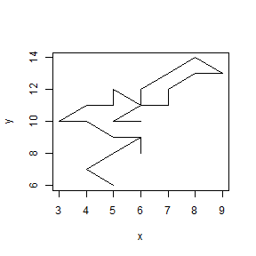
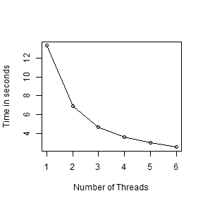

# Problem Set 3
# Michelle Newcomer
Stat 242 Fall 2013
========================================================


### Problem 1


a) Overdispersed binomial probability mass function. Write code using apply:

In the code below, , I first analyze the pmf function using apply, and then it is assessed again using a vectorized version of sum. The pmf is first transposed into a log function to prevent infinite values from the factorial of n. 


```r
# ! /usr/bin/Rscript

require(rbenchmark)
library(rbenchmark)

n <- 2000
k <- matrix(0:n)
p <- 0.3
s <- 0.5


# problem 1 using the log transform

pmfFunc1 <- function(n, k, p, s) {
    logpmf <- lfactorial(n) - lfactorial(k) - lfactorial(n - k) + k * log(k) + (n - 
        k) * log(n - k) - n * log(n) + n * s * log(n) - s * k * log(k) - s * (n - 
        k) * log(n - k) + s * k * log(p) + (n - k) * s * log(1 - p)
    
    if (k[1] == 0) {
        logpmf[k == 0] <- 0
    }
    
    if (k[n + 1] == n) {
        logpmf[k == n] <- 0
    }
    
    expon <- exp(logpmf)
    pmf <- apply(expon, 2, sum)
    return(pmf)
}


# this function below uses a vectorized version of sum
pmfFunc2 <- function(n, k, p, s) {
    logpmf <- lfactorial(n) - lfactorial(k) - lfactorial(n - k) + k * log(k) + (n - 
        k) * log(n - k) - n * log(n) + n * s * log(n) - s * k * log(k) - s * (n - 
        k) * log(n - k) + s * k * log(p) + (n - k) * s * log(1 - p)
    
    if (k[1] == 0) {
        logpmf[k == 0] <- 0
    }
    
    if (k[n + 1] == n) {
        logpmf[k == n] <- 0
    }
    
    expon <- exp(logpmf)
    pmf <- sum(expon)
    return(pmf)
}
```


The example code below shows the pmf calculated without log transforming and the warning message that follows. Calculating the pmf without first transforming into log space does not work because the factorial of n is typically a very large number because n is approximatley 2000.


```r
# problem 1 without log transforming
pmf <- (factorial(n)/(factorial(k) * factorial(n - k))) * ((k^k) * (n - k)^(n - k)/(n^n)) * 
    (((n^n)/((k^k) * (n - k)^(n - k)))^s) * (p^(k * s)) * ((1 - p)^((n - k) * s))

# warnings(last.warning)

# There were 50 or more warnings (use warnings() to see the first 50)
```


b) Compare the timing of the fully vectorized version to the apply version


```r
# b) look at benchmark 2 using the 2 different methods
benchmark(cpmf1 <- pmfFunc1(n, k, p, s), cpmf2 <- pmfFunc2(n, k, p, s), replications = 100)
```

```
##                            test replications elapsed relative user.self
## 1 cpmf1 <- pmfFunc1(n, k, p, s)          100    0.08        1      0.08
## 2 cpmf2 <- pmfFunc2(n, k, p, s)          100    0.08        1      0.08
##   sys.self user.child sys.child
## 1        0         NA        NA
## 2        0         NA        NA
```


Comparison to fastest time on Arwen. My code did not beat the time of running the sum produced by Prof. Paciorek.


```r

 test replications elapsed relative user.self
1 cpmf1 <- pmfFunc1(n, k, p, s)          100   0.192    1.185     0.188
2 cpmf2 <- pmfFunc2(n, k, p, s)          100   0.162    1.000     0.160
  sys.self user.child sys.child
1        0          0         0
2        0          0         0

```


This next section of code tries to use Rprof() to figure out where the bulk of the time is spent. 


```r
# c) use RProf to assess where the code take the longest

Rprof("pmfFunc2.prof")
out <- pmfFunc2(n, k, p, s)
Rprof(NULL)
summaryRprof("pmfFunc2.prof")
```

```
## $by.self
## [1] self.time  self.pct   total.time total.pct 
## <0 rows> (or 0-length row.names)
## 
## $by.total
## [1] total.time total.pct  self.time  self.pct  
## <0 rows> (or 0-length row.names)
## 
## $sample.interval
## [1] 0.02
## 
## $sampling.time
## [1] 0
```


### Problem 2

The purpose of this problem is to calculate a random walk using a loop and then calculating the walk using a vectorized method. 

a) Here is the first method using a for loop.

```r
# discrete random walk
n <- 1000 #number of steps
x0 <- 0 #starting point
y0 <- 0 #y starting point
s <- 4; # number of possibilities
res <- 1 # enter 1 to return only the final point or enter 0 to return the positions
pt0 <- c(x0,y0)
pts <- matrix(data=NA, nrow = n, ncol = 2) # initialize points
pos <- matrix(data=NA, nrow = n, ncol = 2) # initialize positions
set.seed(1)


makeWalk <- function(n, res){
  
  for (i in 1:n) {
    ptnew <- c(sample(-1:1,1),sample(-1:1,1)) #random points
    pts[i,1] <- ptnew[1]
    pts[i,2] <- ptnew[2]
    pos[,1] <- cumsum(pts[1:n,1])
    pos[,2] <- cumsum(pts[1:n,2])
    ptfin <- pos[n,1:2]
  }
  
  if (res == 1) {
    return(ptfin)
  }
  else {
    return(pos)
  }
}

Rprof("makeWalk.prof")
Rprof(NULL)
summaryRprof("makeWalk.prof")
```

```
## $by.self
## [1] self.time  self.pct   total.time total.pct 
## <0 rows> (or 0-length row.names)
## 
## $by.total
## [1] total.time total.pct  self.time  self.pct  
## <0 rows> (or 0-length row.names)
## 
## $sample.interval
## [1] 0.02
## 
## $sampling.time
## [1] 0
```


b) This next section of code vectorizes the random walk and compares the speed of the two methods.

```r
# faster way
makeWalk2 <- function(n, res) {
    ptnew <- matrix(data = NA, nrow = n, ncol = 2)  # positions
    ptnew[, 1] <- sample(-1:1, n, replace = T)  #random points
    ptnew[, 2] <- sample(-1:1, n, replace = T)
    pos[, 1] <- cumsum(ptnew[1:n, 1])
    pos[, 2] <- cumsum(ptnew[1:n, 2])
    ptfin <- pos[n, 1:2]
    
    if (res == 1) {
        return(ptfin)
    } else {
        return(pos)
    }
    
}

benchmark(out <- makeWalk(n, res), out2 <- makeWalk2(n, res), replications = 10)
```

```
##                        test replications elapsed relative user.self sys.self
## 1   out <- makeWalk(n, res)           10    0.61       NA      0.61        0
## 2 out2 <- makeWalk2(n, res)           10    0.00       NA      0.00        0
##   user.child sys.child
## 1         NA        NA
## 2         NA        NA
```


### Problem 3

Embed the fastest version of the code in a Reference Class. I decided to use a reference class because of the structure. I found S3 and S4 classes to be quite confusing and the structure of a reference class was easier to grasp.


```r
#make an Reference class for the random walk

rw <- setRefClass("rw",
  fields = list(
    n = "numeric", 
    x0 = "numeric",
    y0 = "numeric",
    s = "numeric",
    res = "numeric",
    pt0 = "numeric",
    pts = "matrix",
    pos = "matrix",
    ptnew = "matrix",
    ptfin = "numeric"),
                      
  methods = list(
    initialize = function(n,x0,y0,s,res){
      n <<- n #number of steps
      x0 <<- x0 #starting point
      y0 <<- y0 #y starting point
      s <<- s; # number of possibilities
      res <<- res # enter 1 to return only the final point or enter 0 to return the positions
      pts <<- matrix(data=NA, nrow = n, ncol = 2) # initialize points
      pos <<- matrix(data=NA, nrow = n, ncol = 2) # positions
      makeWalk2(n,res)
    },
    
    makeWalk2 = function(n, res){
      set.seed(1)
      pt0 <<- c(x0,y0)
      ptnew <- matrix(data=NA, nrow = n, ncol = 2) # local only 
      ptnew[,1] <- sample(-1:1,n, replace=T) #random points
      ptnew[,2] <- sample(-1:1,n, replace=T)
      pos[,1] <<- cumsum(ptnew[1:n,1])+pt0[1]
      pos[,2] <<- cumsum(ptnew[1:n,2])+pt0[2]
      ptfin <<- pos[n,1:2]
      
      if (res == 1) {
        return(ptfin)
      }
      else {
        return(pos)
      }
      
    },
    
    changeStart = function(newx,newy){
      x0 <<- newx
      y0 <<- newy
      makeWalk2(n,res)
    }
      
    )
)

# n <- 1000 #number of steps
# x0 <- 0 #starting point
# y0 <- 0 #y starting point
# s <- 4; # number of possibilities
# res <- 1 # enter 1 to return only the final point or enter 0 to return the positions


master <- rw$new(30,0,0,4,1)
head(master$field('pos'))
```

```
     [,1] [,2]
[1,]   -1    0
[2,]   -1    0
[3,]   -1    0
[4,]    0   -1
[5,]   -1    0
[6,]    0    1
```

```r
head(master$field('ptfin'))
```

```
[1] 1 3
```

```r

master$changeStart(5,7)
```

```
[1]  6 10
```

```r
head(master$field('pos'))
```

```
     [,1] [,2]
[1,]    4    7
[2,]    4    7
[3,]    4    7
[4,]    5    6
[5,]    4    7
[6,]    5    8
```

```r
tail(master$field('pos'))
```

```
      [,1] [,2]
[25,]    6   12
[26,]    6   11
[27,]    5   10
[28,]    5   10
[29,]    6   10
[30,]    6   10
```

```r
head(master$field('ptfin'))
```

```
[1]  6 10
```


```r
plot(master$field("pos")[, 1], master$field("pos")[, 2], type = "l", xlab = "x", 
    ylab = "y")
```

 


### Problem 4

a) The point at which the maximum memory is used is after the `nalineX` and `nalineY` are created. 


This code shows the memory used for each item:


```r
library(rbenchmark)
Rprof(tf <- "rprof.log", memory.profiling = TRUE)

n = 1e+07
xvar <- sample(c(seq(1, 20, by = 1), NA), n, replace = TRUE)
yvar <- sample(c(seq(1, 20, by = 1), NA), n, replace = TRUE)

# fastcount with a dummy function for res
fastcount <- function(xvar, yvar) {
    nalineX <- is.na(xvar)
    nalineY <- is.na(yvar)
    xvar[nalineX | nalineY] <- 0
    yvar[nalineX | nalineY] <- 0
    useline <- !(nalineX | nalineY)
    # Table must be initialized for -1's
    tablex <- numeric(max(xvar) + 1)
    tabley <- numeric(max(yvar) + 1)
    stopifnot(length(xvar) == length(yvar))
    pf <- parent.frame()
    ls(sys.frame(-1))
    gc(pf)
    res <- function() {
        tablex <<- as.integer(tablex)
        tabley <<- as.integer(tabley)
        as.integer(xvar)
        as.integer(yvar)
        as.integer(useline)
        as.integer(length(xvar))
    }
    
    xuse <- which(tablex > 0)
    xnames <- xuse - 1
    resb <- rbind(tablex[xuse], tabley[xuse])
    colnames(resb) <- xnames
    gc()
    ls.sizes()
    return(resb)
}

# function ls.sizes returns each object in the parent.frame and how large the
# object it
ls.sizes <- function(howMany = 10, minSize = 1) {
    pf <- parent.frame()
    obj <- ls(pf)  # or ls(sys.frame(-1))
    objSizes <- sapply(obj, function(x) {
        object.size(get(x, pf))
    })
    # or sys.frame(-4) to get out of FUN, lapply(), sapply() and sizes()
    objNames <- names(objSizes)
    howmany <- min(howMany, length(objSizes))
    ord <- order(objSizes, decreasing = TRUE)
    objSizes <- objSizes[ord][1:howMany]
    objSizes <- objSizes[objSizes > minSize]
    objSizes <- matrix(objSizes, ncol = 1)
    rownames(objSizes) <- objNames[ord][1:length(objSizes)]
    colnames(objSizes) <- "bytes"
    cat("object")
    print(format(objSizes, justify = "right", width = 11), quote = FALSE)
}

out <- fastcount(xvar, yvar)
```

```
## object        bytes      
## xvar       80000040
## yvar       80000040
## nalineX    40000040
## nalineY    40000040
## useline    40000040
## res            9936
## resb            368
## tablex          208
## tabley          208
## pf               56
```

```r
# summaryRprof(tf)
```


b) I was able to reduce the amount of memory use by substituting an index to find the location where `xvar` is NA. This creates a vector of integers of only the locations that have NA instead of an vector of logicals that use more memory. 


```r
fastcount2 <- function(xvar, yvar) {
    nalineX <- which(is.na(xvar))
    nalineY <- which(is.na(yvar))
    xvar[nalineX] <- 0
    yvar[nalineY] <- 0
    useline <- !(nalineX | nalineY)
    # Table must be initialized for -1's
    tablex <- numeric(max(xvar) + 1)
    tabley <- numeric(max(yvar) + 1)
    stopifnot(length(xvar) == length(yvar))
    pf <- parent.frame()
    ls(sys.frame(-1))
    gc(pf)
    res <- function() {
        tablex <<- as.integer(tablex)
        tabley <<- as.integer(tabley)
        as.integer(xvar)
        as.integer(yvar)
        as.integer(useline)
        as.integer(length(xvar))
    }
    
    xuse <- which(tablex > 0)
    xnames <- xuse - 1
    resb <- rbind(tablex[xuse], tabley[xuse])
    colnames(resb) <- xnames
    gc()
    ls.sizes()
    return(resb)
}

out2 <- fastcount2(xvar, yvar)
```

```
## Warning: longer object length is not a multiple of shorter object length
```

```
## object        bytes      
## xvar       80000040
## yvar       80000040
## nalineX     1906536
## useline     1906536
## nalineY     1905480
## res            9936
## resb            368
## tablex          208
## tabley          208
## pf               56
```

```r
# summaryRprof(tf)
```


### Problem 5

a) The purpose of this problem is to look at the p-fold speed up of matrix multiplication using p=1:6 threads. The script below must be evaluated 6 times by first using the command `export OMP_NUM_THREADS=1:6` in bash. Each time one sets the number of threads, then the R code must be run to evaluate the system time of the matrix algebra. 


```r
#! /usr/bin/bash
# a) 
#in bash
export OMP_NUM_THREADS=5

#! /usr/bin/Rscript
#in R
library(parallel)
set.seed(1)
p <- c(1:6) #number of threads
n <- 4000
mat <- matrix(rnorm(n^2), nrow = n, ncol = n) # positions
nSims <- 60

matMult <- function(mat){
  mn <- mat %*% mat
  return(mn)
}

time <- system.time(
  res <- matMult(mat)
)

#elapsed <- c()
elapsed[6] <- time[3]
save.image(file = "PS5.Rdata")

load(file = "C:/cygwin64/home/Michelle Newcomer/Stat242PSFiles/PS3_link/PS5.Rdata")
```


All of the data from the 6 runs were compiled and plotted below. There is an exponential decline in the speed up of matrix algebra as the number of threads increases. The total elapsed time is approximately 3 seconds using 6 threads. 


```r
load(file = "C:/cygwin64/home/Michelle Newcomer/Stat242PSFiles/PS3_link/PS5.Rdata")
plot(p, elapsed, xlab = "Number of Threads", ylab = "Time in seconds")
lines(p, elapsed)
```

 


b) When using `foreach()` instead of threaded linear algebra, the processing time is substantially longer. The code below used `foreach()` with 8 cores and the total elapsed time was approximately 100 seconds. 


```r
# b)

require(parallel)  # one of the core R packages
require(doParallel)
# require(multicore); require(doMC) # alternative to parallel/doParallel
# require(Rmpi); require(doMPI) # when Rmpi is available as the back-end
require(foreach)
library(foreach)
library(iterators)

set.seed(1)
n <- 4000
nCores <- 8
registerDoParallel(nCores)
mat <- matrix(rnorm(n^2), nrow = n, ncol = n)  # positions

mn <- matrix(data = NA, nrow = n, ncol = n)  # initialize points

matMult <- function(mat, i, mn) {
    for (j in 1:n) {
        mult <- mat[i, ] * mat[, j]
        mn[i, j] <<- sum(mult, na.exclude = TRUE)
    }
    return(mn[i, ])
}

system.time(out <- foreach(i = 1:n, .combine = c) %dopar% {
    outSub <- matMult(mat, i, mn)
    outSub  # this will become part of the out object
})

finalMat <- matrix(out, length(out)/n, byrow = T)

```


