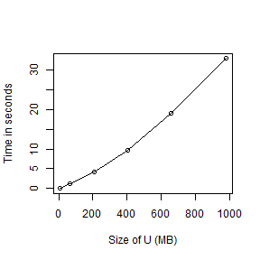

# Problem Set 4
# Michelle Newcomer
Stat 242 Fall 2013
========================================================


### Problem 1


```r
# Problem 1--------------------------------------------------------------

# Please see the attached pages for the calculations
options(digits = 22)
```


### Problem 2

###a) 
We can expect at most 16 digits of accuracy based on a 64 bit system (8 bytes for a double). 

```r
d <- 1.000000000001
d
```

```
## [1] 1.000000000001000088901
```


###b) 
The sum does not give the accuracy up to what we would expect in part a. The sum function only gives accuracy up to the 12th digit, so the sum function is not acting as expected.


```r
b <- 1 + 10000 * (1e-16)
b
```

```
## [1] 1.000000000001000088901
```

```r

c <- 1 + 1e-12
c
```

```
## [1] 1.000000000001000088901
```

```r

x <- c(1, rep(1e-16, 10000))
y <- sum(x)
y
```

```
## [1] 1.000000000000999644811
```


###c) 
The sum in  python does not give any digits of accuracy. This is a surprising. It shows that python is not including the 16th digit in the sum function. 


```python
#! /usr/bin/python
import decimal
import numpy as np 

from decimal import *

getcontext().prec = 22

v = np.r_[1,[1e-16]*10000]
vsum = sum(v)

>>> vsum
1.0

```


###d) 

The code chunk below gives the same result produced by python. This does not give the right answer.

```r
e <- 0
x <- c(1, rep(1e-16, 10000))  # for loop with the 1 first
for (i in 1:(length(x) - 1)) {
    e[1] <- x[1]
    e[i + 1] <- x[i + 1] + e[i]
}
e[length(e)]
```

```
## [1] 1
```


When 1 is placed last in the for loop sum, it does give the right answer to 16 digits of accuracy. 

```r
e <- 0
x <- c(rep(1e-16, 10000), 1)  #for loop with the 1 value last
for (i in 1:(length(x) - 1)) {
    e[1] <- x[1]
    e[i + 1] <- x[i + 1] + e[i]
}
e[length(e)]
```

```
## [1] 1.000000000001000088901
```


When the same code is run in python, similar results occur. When the 1 is placed last is gives the right answer up to 16 digits of accuracy. 


```python
#! /usr/bin/python
v = np.r_[1,[1e-16]*10000]

e = [0]*len(v)
n=len(v)-1
for i in range(n):
  e[0] = v[0]
  e[i+1]=v[i+1]+e[i]

e[len(e)-1]

>>> e[len(e)-1]
1.0


# the section below places the 1 last
v = np.r_[[1e-16]*10000,1]

e = [0]*len(v)
n=len(v)-1
for i in range(n):
  e[0] = v[0]
  e[i+1]=v[i+1]+e[i]

e[len(e)-1]

>>> e[len(e)-1]
1.0000000000010001

```


###e) 
This sum suggests that the sum function is summing from left to right, similar to the for loop. Because the number 1 requires an extra digit in front of the decimal, that means that 1e-16 will not be included in the sum at any point because it does not contribute in the decimal place needed by the 1. 


### Problem 3

###a) 
Please see the attached pages for the calculation of the order. 

###b) 
Based on the calculation algorithm, it is ok to replace the original matrix A without needing the matrix for later computations.

###c) 
Memory use does match that from part b. The memory use is just the size of the matrix predicted in part b. 


```r
n <- c(20, 200, 2000, 3000, 4000, 5000, 6000)
times <- 0
max.size <- 0
size <- 0

j = 0
for (i in n) {
    j = j + 1
    X <- crossprod(matrix(rnorm(i^2), i))
    mem1 <- gc()
    time <- system.time(U <- chol(X))  # U is upper-triangular
    mem2 <- gc()
    times[j] <- time[3]
    max.size[j] <- mem2[10] * 8/1e+06
    size[j] <- i
}
```


The figure below shows that as the size of the matrix U increases the time for the Cholesky calculation increases exponentially. 


 


### Problem 4


```r
# a) using solve()%*%y, solve(X,y), and the Cholesky decomposition
n <- 5000
set.seed(1)
X <- crossprod(matrix(rnorm(n^2), nr = n))  #This does t(X)*X producing a p.d. matrix
set.seed(2)
y <- c(rnorm(n))
kappa(X, exact = TRUE)
```

```
## [1] 391726556.6102768182755
```

```r

# part 1 using solve()%*%y

system.time(b1 <- solve(X) %*% y)
```

```
##                       user                     system 
## 107.1299999999999954525265   0.2800000000000000266454 
##                    elapsed 
## 107.4199999999982537701726
```

```r

# part 2 using solve(X,y)

system.time(b2 <- solve(X, y))
```

```
##                       user                     system 
## 21.69999999999998863131623  0.03000000000000002664535 
##                    elapsed 
## 21.76000000000203726813197
```

```r

# part 3 using the Cholesky decomposition

system.time(U <- chol(X))  #produces U which is upper triangular
```

```
##                       user                     system 
## 19.09000000000003183231456  0.01000000000000000888178 
##                    elapsed 
## 19.12000000000261934474111
```

```r
system.time(b3 <- backsolve(U, backsolve(U, y, transpose = TRUE)))
```

```
##                      user                    system                   elapsed 
## 0.16999999999995907273842 0.06000000000000005329071 0.22999999999592546373606
```


###a) 
The method using `solve() %*% Y` takes the longest, while the Cholesky decomposition takes the shortest amount of time. `Solve(X) %*% Y` takes the longest because it is computing a normalized solution to X and then computing matrix multiplication with Y, almost doubling the number of computations.  

###b)
The values for all three methods are very similar however they are not the same up to machine precision. Generally, the values agree up to 6-7 digits. The condition number for this matrix is quite large and thus is prone to more error relative to small changes of input. 


```r
options(digits = 22)
b1[1:5]
```

```
## [1]  -65.137631529794333573591 -108.299597057838241198624
## [3]   -4.269136263276114284793   63.473915434202702101629
## [5]  -40.264835625715463152119
```

```r
b2[1:5]
```

```
## [1]  -65.137631529792088258546 -108.299597057836592739477
## [3]   -4.269136263275830067698   63.473915434202112351159
## [5]  -40.264835625716216327419
```

```r
b3[1:5]
```

```
## [1]  -65.137631776542477268777 -108.299597441462381652855
## [3]   -4.269136288862252825993   63.473915645925053752308
## [5]  -40.264835782489470261680
```


### Problem 5
Please see the attached pages for written work, calculations, and pseudo-code.

###a) 
More efficient code to do the calculations. 


```r
options(digits = 3)


cholDecomp <- function(n) {
    set.seed(1)
    X <- crossprod(matrix(rnorm(n^2), nr = n))  #This does t(X)*X producing a p.d. matrix
    set.seed(2)
    Y <- c(rnorm(n))
    
    U <- chol(X)  #produces U which is upper triangular
    Q <- t(U) %*% U
    
    b1 <- backsolve(U, backsolve(U, Y, transpose = TRUE))
    b2 <- solve(Q, Y)
    return(b1)  #or could return b2. They both produce the same answer
}

n = 100
b1 <- cholDecomp(n)

b1[1:5]
```

```
## [1]  0.6059 -1.4323  0.5676 -1.2280  0.0835
```

```r

# solved using eigendecomposition

eigDecomp <- function(n) {
    set.seed(1)
    X <- crossprod(matrix(rnorm(n^2), nr = n))  #This does t(X)*X producing a p.d. matrix
    set.seed(2)
    Y <- c(rnorm(n))
    E <- eigen(X)
    S <- E$vectors
    L <- matrix(rep(E$values, n), nr = n)
    
    # (S*sqrt(t(L)))%*%(sqrt((L))*t(S)) #this correctly produces the sigma matrix
    P <- S * sqrt(t(L))
    C <- t(X) %*% P %*% t(P) %*% X
    D <- t(X) %*% P %*% t(P) %*% Y
    b3 <- solve(C, D)
    return(b3)
}

b3 <- eigDecomp(n)
b3[1:5]
```

```
## [1]  0.6059 -1.4323  0.5676 -1.2280  0.0835
```


### Problem 6

Please see the attached sheet for calculations. 

Approach A requires less memory and total number of numbers than approach B. If n = 100, and p = 10, approach A uses a total of 80.1 MB per worker and passes 1,110 total numbers to each worker for the computation. 


```r
# Approach A
require(parallel)
```

```
## Loading required package: parallel
```

```r
require(doParallel)
```

```
## Loading required package: doParallel Loading required package: foreach foreach:
## simple, scalable parallel programming from Revolution Analytics Use Revolution
## R for scalability, fault tolerance and more. http://www.revolutionanalytics.com
## Loading required package: iterators
```

```r
library(foreach)
library(iterators)

n <- 400
p <- 8
registerDoParallel(p)
times <- 0
max.size <- 0
size <- 0


mat1 <- matrix(rnorm(n * n), n)
mat2 <- matrix(rnorm(n * n), n)

mat3 <- foreach(i = 1:p, .inorder = TRUE, .combine = cbind) %dopar% {
    mat1 %*% mat2[, (n * (i - 1)/p + 1):(n * i/p)]
}
```


Approach B loops through the rows of the first matrix and sends each loop to the foreach command. In total, each worker uses 80.2 MB of memory and passes 2000 numbers total to each worker. 


```r

# Approach B

require(parallel)
require(doParallel)
library(foreach)
library(iterators)

n <- 400
p <- 8
registerDoParallel(p)

mat1 <- matrix(rnorm(n * n), n)
mat2 <- matrix(rnorm(n * n), n)
mat3 <- c()

matMult <- for (i in 1:p) {
    a <- mat1[(n * (i - 1)/p + 1):(n * i/p), ]
    c <- foreach(j = 1:p, .inorder = TRUE, .combine = cbind) %dopar% {
        a %*% mat2[, (n * (j - 1)/p + 1):(n * j/p)]
    }
    mat3 <- rbind(c, mat3)
}
```


For n=160 and p=16 Approach C requires each worker (only sqrt(16)=4 are used) to use 20.6 MB of memory, however passes 12,800 numbers total to each worker. Compared to Approach A and B, Approach C uses the least amount of memory total per worker which may be faster if the matrices were small. However, because Approach C passes an order of magnitude more numbers to each worker this may slow down the computation because of the overhead cost in time of passing the numbers. 


