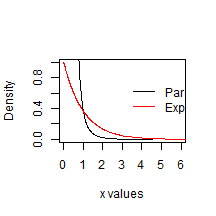
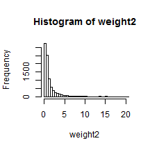
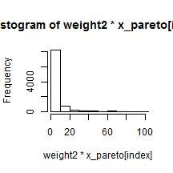
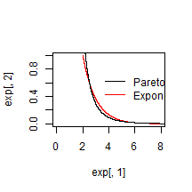
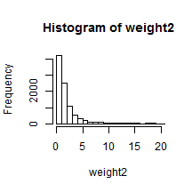
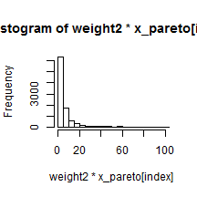
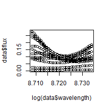
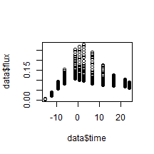
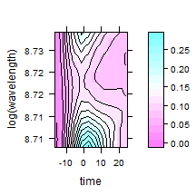
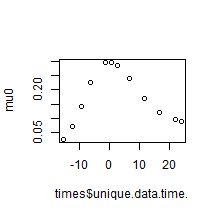

# Problem Set 5
# Michelle Newcomer
Stat 242 Fall 2013
========================================================


### Problem 1
Completed during section

### Problem 2
Part a

```r
# Part a
require(VGAM)
require(stats)

# plot pareto distribution
alpha <- 0.5
beta <- 3
m <- 1000  # number of observations
set.seed(0)
x_pareto <- rpareto(m, location = alpha, shape = beta)
f_pareto <- dpareto(x_pareto, location = alpha, shape = beta)  # density of x under f
pareto <- cbind(x_pareto, f_pareto)
pareto <- pareto[order(pareto[, 1]), ]

# plot exponential distribution
k <- 1
m <- 1000  # number of observations
set.seed(0)
x_exp <- rexp(m, rate = 1/k)
f_exp <- dexp(x_exp, rate = 1/k, log = FALSE)  # density of x under f
exp <- cbind(x_exp, f_exp)
exp <- exp[order(exp[, 1]), ]
```


 


The tail of the Pareto distribution does indeed decay more quickly than that of the exponential distribution.

Part b

```r
# part b: f is the exponential density

m <- 10000  # number of samples for each estimator
set.seed(0)
k <- 1
x_exp <- rexp(m, rate = 1/k) + 2
f_exp <- dexp(x_exp - 2, rate = 1/k, log = FALSE)  # density of x under g
exp <- cbind(x_exp, f_exp)
exp <- exp[order(exp[, 1]), ]

alpha <- 2
beta <- 3
m <- 10000  # number of observations
set.seed(0)
x_pareto <- rpareto(m, location = alpha, shape = beta)
g_pareto <- dpareto(x_pareto, location = alpha, shape = beta)  # density of x under f
pareto <- cbind(x_pareto, g_pareto)
pareto <- pareto[order(pareto[, 1]), ]

weight <- f_exp/g_pareto
weight <- sort(weight)

EX <- sum(x_pareto * weight)/m
EX2 <- sum(x_pareto^2 * weight)/m
EX
```

```
## [1] 88.7
```

```r
EX2
```

```
## [1] 268
```


   


There are some extreme weights >1000 that I had to eliminate from the graph to make the histogram visible. 

Part C

```r
# part c: f is the pareto distribution

m <- 10000  # number of samples for each estimator
set.seed(0)
k <- 1
x_exp <- rexp(m, rate = 1/k) + 2
g_exp <- dexp(x_exp - 2, rate = 1/k, log = FALSE)  # density of x under g
exp <- cbind(x_exp, g_exp)
exp <- exp[order(exp[, 1]), ]

alpha <- 2
beta <- 3
m <- 10000  # number of observations
set.seed(0)
x_pareto <- rpareto(m, location = alpha, shape = beta)
f_pareto <- dpareto(x_pareto, location = alpha, shape = beta)  # density of x under f
pareto <- cbind(x_pareto, f_pareto)
pareto <- pareto[order(pareto[, 1]), ]

weight <- f_pareto/g_exp
weight <- sort(weight)

EX <- sum(x_pareto * weight)/m
EX2 <- sum(x_pareto^2 * weight)/m
EX
```

```
## [1] 21.4
```

```r
EX2
```

```
## [1] 73.1
```


   


With the pareto distribution as f this time, there were still extreme weights that had to be eliminated for proper graphing. 

\newpage

### Problem 3
Part a
The EM algorithm is shown in the attached pages. 

Part b
Reasonable starting values include `beta0=c(1,1,1,1)`

Part c

```r
# part c
n = 100
beta0 = matrix(c(1, 1, 1, 1), 4, 1)
X = matrix(rnorm(n * 4), 4, n)
Y <- t(X) %*% beta0
Y <- ifelse(Y <= 0, 0, 1)

betat <- matrix(c(1, 0, 0, 1), 4, 1)
diff = 1

while (diff > 0.05) {
    t <- t(X) %*% betat
    phi <- pnorm(t)
    pdf <- 1/sqrt(2 * pi) * exp(-1/2 * (t)^2)
    mlltest <- (Y - phi)/(phi * (1 - phi)) * pdf
    model <- lm(mlltest ~ 0 + t(X))
    beta_new <- model[[1]]
    diff <- sum(abs(betat - beta_new))
    betat <- beta_new
}
betat
```

```
## t(X)1 t(X)2 t(X)3 t(X)4 
## 0.166 0.247 0.247 0.213
```


Part D

```r
# Part d using optim
n = 100
beta0 = matrix(c(1, 1, 1, 1), 4, 1)
X = matrix(rnorm(n * 4), 4, n)
Y <- t(X) %*% beta0
Y <- ifelse(Y <= 0, 0, 1)

betat <- matrix(c(0.5, 0.5, 0, 0), 4, 1)

probit.LogLik <- function(beta, X, Y) {
    phi <- pnorm(t(X) %*% beta)
    loglik <- log(Y * (phi) + (1 - Y) * (1 - phi))
    out <- return(-sum(loglik))
}

out <- optim(betat, probit.LogLik, Y = Y, X = X, method = "BFGS", hessian = T)
out
```

```
## $par
##      [,1]
## [1,] 27.7
## [2,] 25.6
## [3,] 26.0
## [4,] 29.5
## 
## $value
## [1] 0.00899
## 
## $counts
## function gradient 
##      109      100 
## 
## $convergence
## [1] 1
## 
## $message
## NULL
## 
## $hessian
##         [,1]     [,2]     [,3]     [,4]
## [1,]  0.0493 -0.01643 -0.01756 -0.01608
## [2,] -0.0164  0.03762  0.00258 -0.01893
## [3,] -0.0176  0.00258  0.00914  0.00635
## [4,] -0.0161 -0.01893  0.00635  0.02566
```

```r

vcov <- solve(abs(-out$hessian))
se <- sqrt(diag(vcov))
se
```

```
## [1]  9.20  7.37 20.94  8.73
```

```r

z.score <- out$par/se
z.score
```

```
##      [,1]
## [1,] 3.01
## [2,] 3.48
## [3,] 1.24
## [4,] 3.38
```


\newpage

### Problem 4
Part a


```r
# part a
library(maptools)
library(lattice)
library(fields)
library(cluster)
load("ps5prob5.RData")
```


   


Part b

A reasonable set of starting values for kappa and lambda include `k=1` and `l=0.3`.


```r
names(meanpts) <- c("time", "value")
# this creates the function, meanfunc()
meanfunc <- with(list(spf = splinefun(meanpts$time, meanpts$value, method = "natural"), 
    minday = min(meanpts$time), maxday = max(meanpts$time)), function(theta, times) {
    j = 1:nrow(times)
    rescaled[j, 1] <- times[j, 1]/theta$lambda
    if (any(rescaled < minday | rescaled > maxday)) 
        warning("Extrapolating beyond the range of the template data")
    mean[j, 1] <- theta$kappa * spf(rescaled[j, 1])
    return(mean)
})


theta <- data.frame(0, 0)
theta[1, ] <- c(1, 0.3)
names(theta) <- c("lambda", "kappa")
times <- data.frame(unique(data$time))
rescaled <- matrix(NA, nrow = nrow(times))
mean <- matrix(NA, nrow = nrow(times))

mu0 <- meanfunc(theta, times)

theta
```

```
##   lambda kappa
## 1      1   0.3
```


 


Part C
Please see the attached paper for the log-liklihood function to use in the R optimization

```r
# section to create the covariance matrix
time <- unique(data$time)
wavelengths <- unique(data$wavelength)

time_y_matrix <- matrix(time, length(time), length(wavelengths))
wave_x_matrix <- t(matrix(wavelengths, length(wavelengths), length(time)))

sigma <- 0.11
row <- 0.082
rot <- 1.5
tau <- 0.03
alpha <- 0.01
cov_matrix <- matrix(NA, length(time), length(wavelengths))
nu <- matrix(data$fluxerror^2, 12, 34)

cov <- function(mu0, sigma, row, rot, tau, alpha, nu, wave_x_matrix, time_y_matrix) {
    for (j in 1:length(time)) {
        for (i in 1:length(wavelengths)) {
            w_diff <- log(wave_x_matrix) - log(wave_x_matrix[, j])
            t_diff <- time_y_matrix - time_y_matrix[j, ]
            if (t_diff[j, i] == 0) {
                I = 1
            } else {
                I = 0
            }
            if (w_diff[j, i] == 0 & t_diff[j, i] == 0) {
                I2 = 1
            } else {
                I2 = 0
            }
            cov_temp <- sigma * exp(-abs(w_diff[j, i])/row) * exp(-abs(t_diff[j, 
                i])/rot) + tau * I + alpha * nu[j, i] * I2
            cov_matrix[j, i] <- cov_temp
        }
    }
    
    return(cov_matrix)
}

cov_matrix <- cov(mu0, sigma, row, rot, tau, alpha, nu, wave_x_matrix, time_y_matrix)
```


Part D

```r
# part D create the log-liklihood function and optimize
theta0 <- c(sigma, row, rot, tau, alpha)
Y <- matrix(data$flux, 12, 34)

loglik <- function(theta0, Y, mu0, nu, wave_x_matrix, time_y_matrix) {
    cov_matrix <- cov(mu0, theta0[1], theta0[2], theta0[3], theta0[4], theta0[5], 
        nu, wave_x_matrix, time_y_matrix)
    term1 <- log(det(t(cov_matrix) %*% cov_matrix)^-1/2)
    v <- Y[1, ] - mu0[1]
    c <- solve(t(cov_matrix) %*% cov_matrix, v)
    term2 <- 1/2 * t(v) * c
    logl <- term1 - log(sqrt(2 * pi)) - term2
    out <- return(sum(logl))
}

out <- optim(par = theta0, loglik, Y = Y, mu0 = mu0, nu = nu, wave_x_matrix = wave_x_matrix, 
    time_y_matrix = time_y_matrix, method = "BFGS", hessian = T)
```


